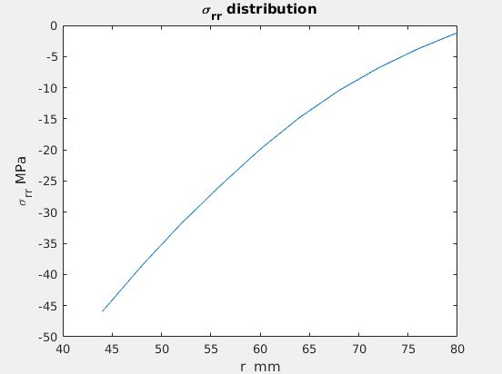
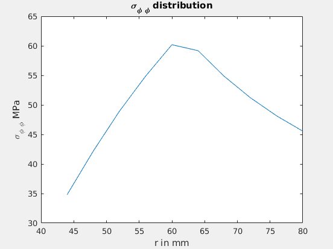

# FEM (Matlab/Octave)

A Matlab/Octave program which solves a static nonlinear FEM problem with linear
shape functions, for an ideal elastic-plastic material. Stress-Distribution,
elastic and plastic regimes, convergence crteria are generated

### How to run?

```bash
make
```

### Files:

- `input.m` :: The file to start with
- `ElastoPlastic.m` :: The file to calculate elastic + plastic strains
- `Elastic.m` :: The file to calculate elastic convergence
- `ElementRoutine.m` :: to determine J, B, N matrix values
- `MaterialRoutine.m` :: Material routine for elastic ideal-plastic material
- `exact.m` :: to calculate the analytical solution

### Procedure

Change the value in of 'mode' to either '1' or '2' in `Input.m` file to switch
between:

- `mode = 1` -> for calculating elastic convergence,
- `mode = 2` -> for calculating elastic + plastic strains

Can also modify the other parameters based on the needs:

- elements
- yield stress, E, Nu
- inner/outer radius
- Gauss points
- time-step

### Plots

- 
- 
- 
- 
- 
